# Cloud Computing - Microservices

## Students

- Mpoki MWAISELA - mail: mpoki.mwaisela@grenoble-inp.org - GitHub ID: MpokiAbel
- Almo CUCI - mail: almo.cuci@grenoble-inp.org - GitHub ID: cucialmo
- Josquin IMBERT - mail: josquin.imbert@etu.univ-grenoble-alpes.fr - GitHub ID: JosquinIMBERT

## First Local Deployment

### Registry and Gateway

The architecture of the application was composed of the following parts: 

1. JHipster API Gateway, a component in the JHipster microservice architecture that serves as an entry point for client applications. It acts as a reverse proxy for microservices, routing requests from clients to the appropriate microservice and providing centralized security, monitoring, and logging functionality. JHipster API Gateway, provides a single access point for clients.
2. JHipster Service Registry, another component in the JHipster microservice architecture that acts as a registry for all microservices in the system. It provides a central location where the location of all microservices can be stored and updated dynamically. It also provides information about the available microservices to clients, including their current status, endpoint locations, and metadata.
3. One microservice called productorder which is using a relational mysql database.
4. One microservice called invoice which is using another relational postgresql database.
5. One microservice called notification using a non-relational mongodb database.

Single Page Application (SPA) frontend will communicate with the microservices through API Gateway, since the later acts as a reverse proxy and a single entry point for all incoming requests from the frontend.

We create the respective JHipster projects for Gateway, Service Registry, productorder, invoice, notification which are going to be deployed manually one after the other.

Launching the JHipster registry locally:

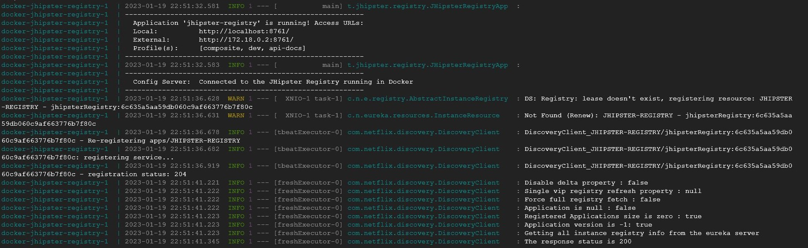

Launching the gateway with a development environment/profile configuration:

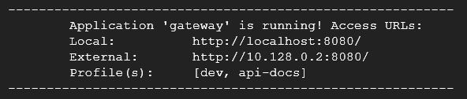

Since the Gateway is up now, the SPA fronted is accessible and we can browse the application.

Accessing the application (localhost:8080):

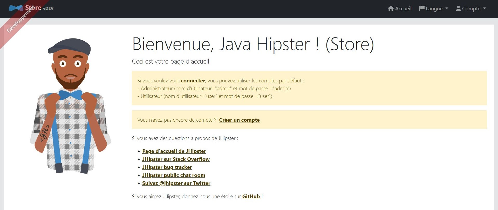

Accessing the Service Registry (localhost:8761):

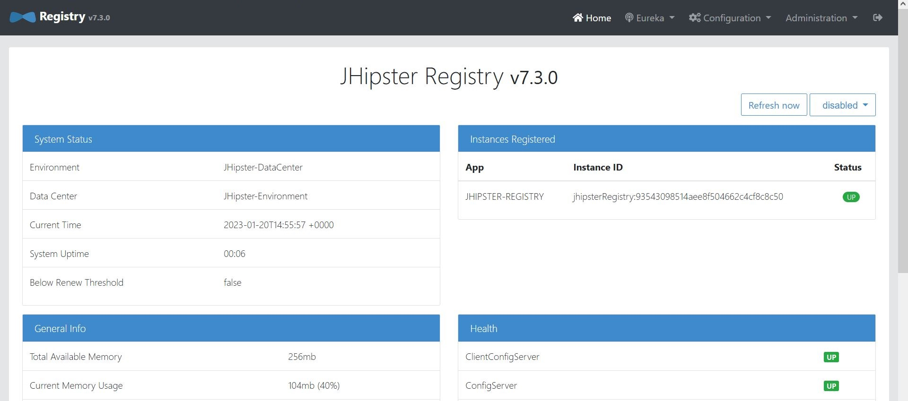
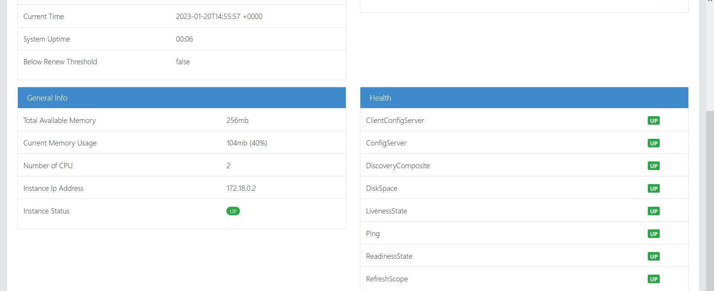

### Microservices

Recalling the projects we created previously, using Gradle (the automation tool) we run the productorder, notifications and invoice projects into the microservices. Those microservices lack the front-end, so that is why we create a route in the API Gateway that maps to the frontend of the microservices.

Once we did these steps, we were able to browse the application:

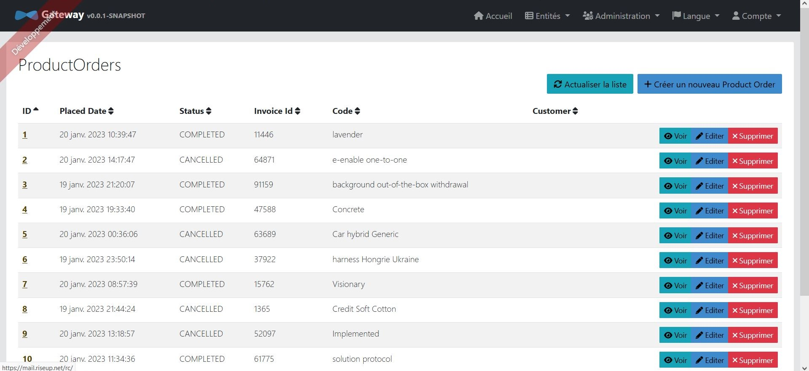

And to see the microservices in the registry's web interface:

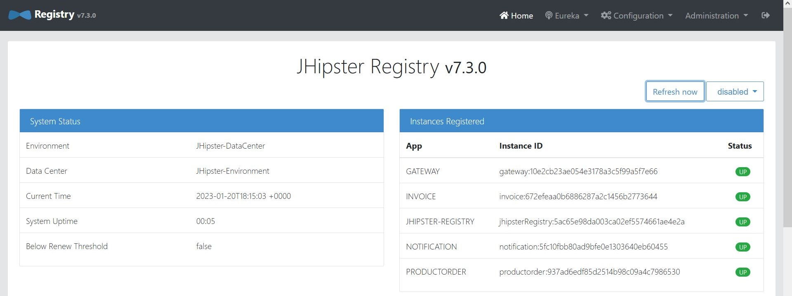

While interacting with the application, if one of the microservices is stopped, then the other microservices, gateway and the registy will be not affected, they will continue to be up. Meanwhile, on the service registry, the microservice that failed, is going to disappear from the list.

## Docker generation

Refactoring the schema of an application in three microservices means dividing the application's functionalities into smaller, independent services. This allows the different parts of the application to be developed, deployed, and maintained separately. The source code for each microservice can then be generated using JHipster. The generated source code includes the necessary boilerplate code and configurations for the microservice to function independently. 
For each microservice and the gateway frontend, we import the jdl files in into our particular JHipster project. The JDL is a high-level description of the application's entities and the relationships between them.

We generated the docker images for our microservices:

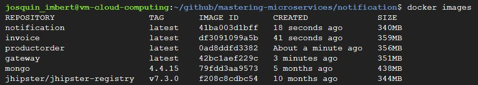

And we generated the docker-compose files and scaled the invoice service up to 2 replicas:

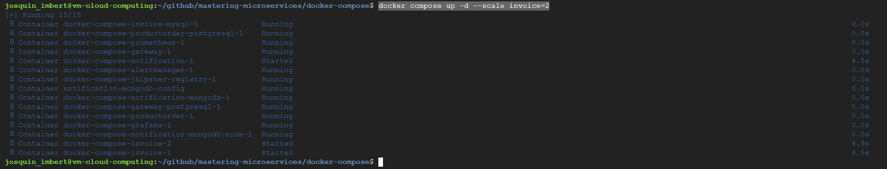

We were able to observe the two invoice replicas in the JHipster Registry:

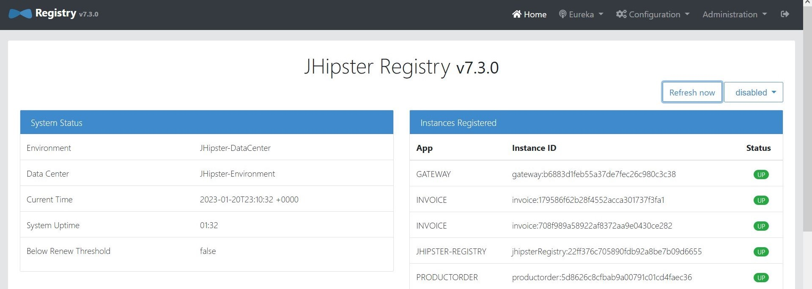

## Monitoring

We were able to browse JHipster metrics, health-checks and logs:

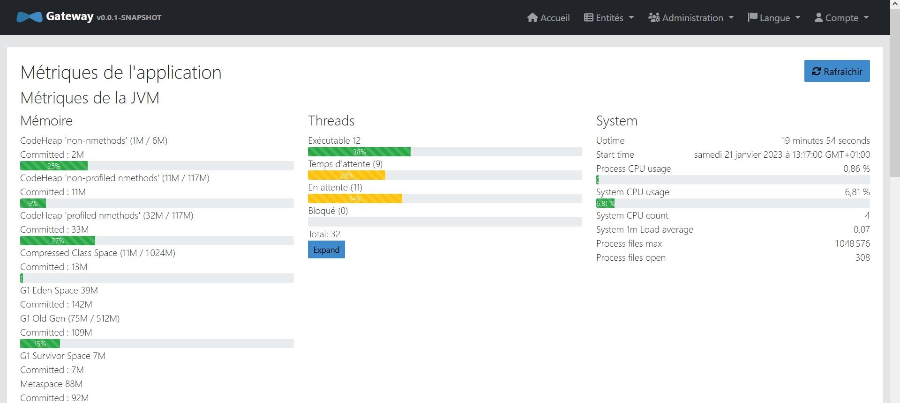
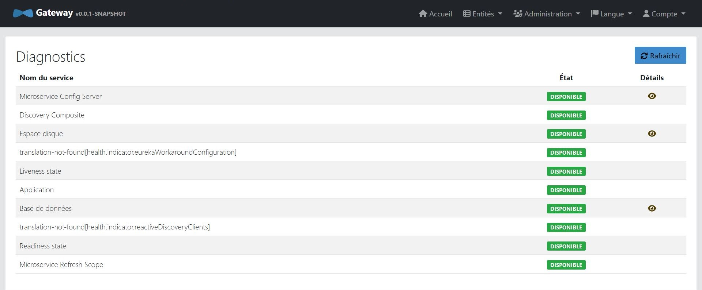
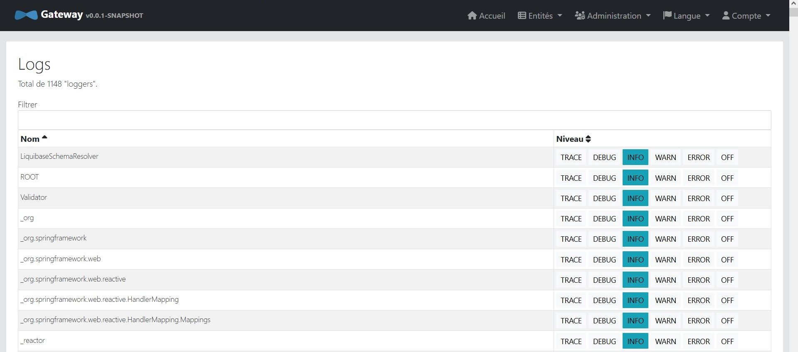

We also started Grafana, added a Prometheus source to it, and ran a CPU usage query:

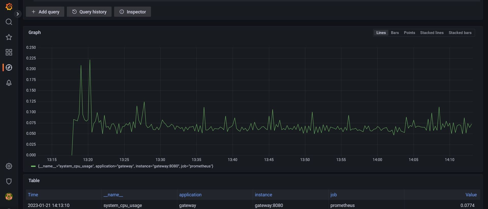

## Kubernetes Part

As the steps earlier, we create another JHipster project now, to be deployed in Kubernetes, with all the necessary files needed. Previously, we also created the containerized images for the microservices and the gateway, so what is left to do is to push those images into the docker public registry, in the repository called "masteringmicroservice", to be able to use those images in different environments, such as the Kubernetes cluster opposed to the local deployment we managed to do earlier.

Next step is creating manually the cluster as guided on the tutorial in the area "europe-west1-b" and name it "tuto-cluster". Then, we retrieve the credentials for a Google Kubernetes Engine (GKE) cluster that we created. The retrieved credentials are used to connect to the cluster and manage it using the Kubernetes command-line tool kubectl. Now, we can interact with the resources in our cluster, such as deploy and manage containers, monitor logs etc.
Using the shell script, we apply a Kubernetes configuration to the cluster, through the kubectl command, that is used to create or update resources in a Kubernetes cluster.The command takes a Kubernetes manifest file as input, which defines the desired state of your cluster, and updates the cluster to match the desired state. If the resources specified in the manifest file do not exist in the cluster, they will be created. If they already exist, they will be updated to match the specified state.

The services are deployed in the cluster:

We can retrieve information about the services in a Kubernetes cluster. We can see the cluster they are deployed on, the IPs and the ports. We have the following results: 

Moreover, we could try to expose one of the services of the cluster, making it accessible from outside the cluster. In this case, the service being exposed is named jhipster-registry. The service should be exposed as a NodePort. A NodePort is a type of service that allows you to access the service from outside the cluster by using the IP address of any of the nodes in the cluster and a specific port number. The exposed service will be named exposed-registry.

